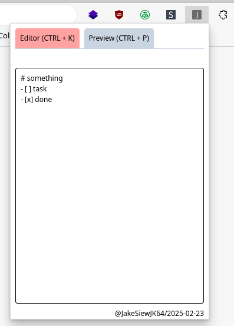

# Custom Markdown Note Extension for Chrome Browsers

Date Created: 2025-02-23

Author: JakeSiewJK64

### Description

To create a basic extension to keep notes on local storage in markdown format. Includes hotkeys to switch between editor and preview.

### How to install

step 1: clone the repository.

step 2: run `npm run build` in the root directory of the project.

step 3: open a chrome browser. In this case, I am using Microsoft Edge.

step 4: go to `edge://extensions/` in the address bar.

step 5: enable developer mode on the left settings.

step 6: click on `Load unpacked`, select the build folder generated from step 2.

step 7: the installation is complete.

### Screenshots

